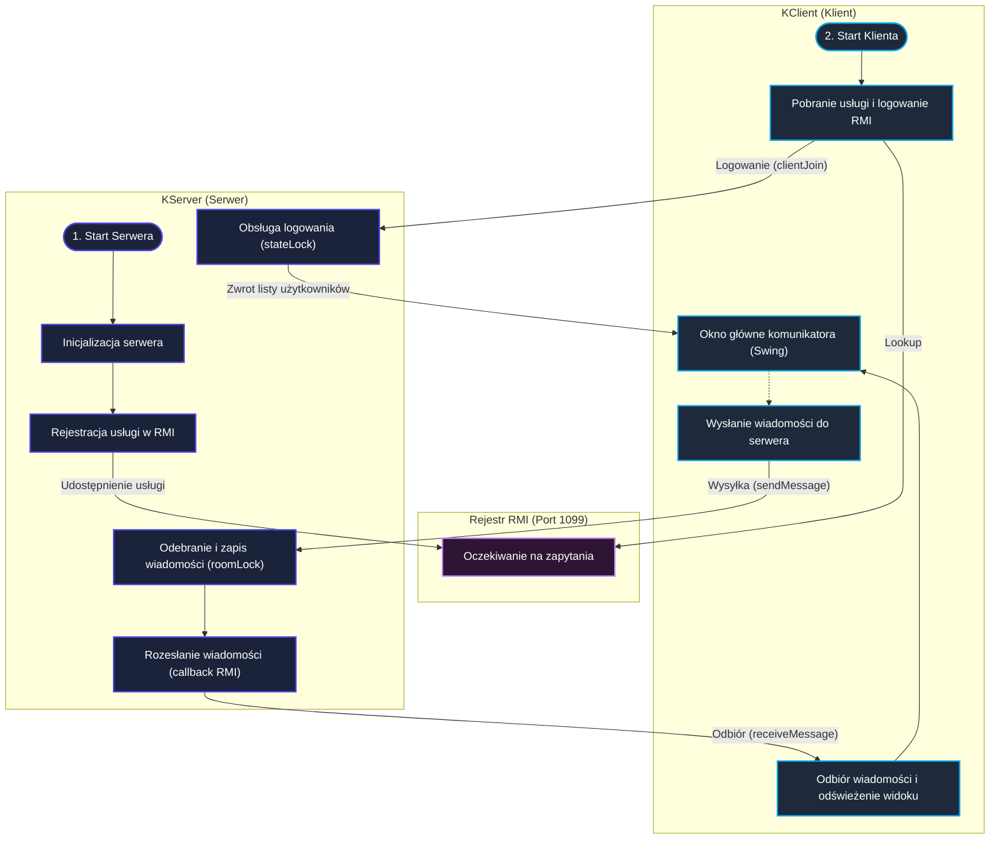

# Komunikator RMI ze Swing GUI
## Autorzy:
* Maksymilian Haliński
* Paweł Bernaciak

## Podział prac:
* Maksymilian Haliński - implementacja serwera, sporządzenie dokumentacji
* Paweł Bernaciak - implementacja Klienta, stworzenie GUI

## Komunikator RMI ze Swing GUI

## Cel i zakres projektu:
Zaprojektowanie i implementacja rozproszonego komunikatora, który pozwala na przesyłanie wiadomości w czasie rzeczywistym między wieloma klientami.

### Przyjęte założenia:
1. Architektura Klient-Serwer: Serwer przechowuje dane w pamięci i pośredniczy w komunkacji, a klient udostępnia interfejs graficzny.
2. Współbieżność: Serwer obsługuje wielu klientów jednocześnie, dbając o brak zakleszczeń i minimalizację sekcji krytycznych.
3. Przesyłanie struktur za pomocą obiektów DTO implementujących interfejs Serializable.
4. Możliwość tworzenia pokoi czatu z dużą ilością użytkowników oraz wysyłania prywatnych wiadomości między parą użytkowników.

## Architektura i struktura logiczna:

## Specyfikacja interfejsu zdalnego:
Zdalne usługi serwera zostały zdefiniowane w interfejsie `ChatService` i zaimplementowane w klasie `ChatServiceImpl`.

### Metody wystawione przez serwer:
1. `List<User> clientJoin(ChatObserver client, User user) throws RemoteException` 
   * Opis: Rejestruje aktywnego klienta (ChatObserver) na serwerze i ustawia status użytkownika na online. Zwraca listę aktualnie zalogowanych użytkowników online.
2. `void clientLeave(ChatObserver client, User user) throws RemoteException`
   * Opis: Wylogowywuje klienta z serwera przy zamykaniu aplikacji i oznacza użytkownika jako offline.
3. `void sendMessage(Message message) throws RemoteException`
   * Opis: Odbiera nową wiadomość od nadawcy, zapisuje ją w historii pokoju na serwerze, a następnie rozsyła do wszystkich uczestników pokoju, którzy są aktualnie online.
4. `List<Message> getChatHistory(String chatRoomId) throws RemoteException`
   * Opis: Zwraca całą dotychczasową historię wiadomości zapisaną dla pokoju o podanym identyfikatorze.
5. `ChatRoom createChatRoom(String roomName, List<String> participants) throws RemoteException`
   * Opis: Tworzy nowy pokój rozmów grupowych o określonej nazwie z wybraną listą uczestników. Informuje uczestników o nowo stworzonym pokoju.
6. `ChatRoom getOrCreateDirectMessage(String user1, String user2) throws RemoteException`
   * Opis: Pobiera istniejący lub automatycznie tworzy nowy, pokój rozmów prywatnych między parą użytkowników.
7. `List<ChatRoom> getUserChatRooms(String username) throws RemoteException`
   * Opis: Pobiera listę wszystkich pokojów (zarówno grupowych, jak i DM), do których należy dany użytkownik.
8. `List<User> getRegisteredUsers() throws RemoteException`
   * Opis: Zwraca listę wszystkich użytkowników, którzy kiedykolwiek zalogowali się do serwera.

## Model współbieżności i synchronizacji:

### Opis sekcji krytycznych:

1. **Logowanie i Wylogowywanie (`clientJoin` / `clientLeave`):**
   Sekcją krytyczną jest jednoczesna modyfikacja map aktywnych połączeń oraz statusów użytkowników. Zabezpieczono ją za pomocą `ReentrantLock`. Blokada ta gwarantuje spójność statusu online/offline w systemie.
2. **Modyfikacja i odczyt historii wiadomości czatów (`sendMessage` / `getChatHistory`):**
   Wysyłanie wiadomości do tego samego pokoju przez wielu klientów naraz, mogłoby doprowadzić do utracenia niektórych wiadomości. Aby temu zapobiec, serwer synchronizuje te operacje za pomocą blokad drobnoziarnistych.

### Wykorzystane mechanizmy:
1. `ReentrantLock`: Zabezpiecza operacje logowania i wylogowywania.
2. **Mapa blokad `roomLocks` typu `ConcurrentHashMap<String, ReentrantLock>`:** Implementuje blokowanie drobnoziarniste. Każdy pokój ma swoją dedykowaną, niezależną blokadę. Dzięki temu wysyłanie wiadomości w pokoju A nie blokuje odczytu ani zapisu wiadomości w pokoju B.
3. `ConcurrentHashMap`: Wykorzystana jako struktura przechowująca aktywnych klientów, pokoje rozmów i historię wiadomości w celu bezpiecznego odczytu bez konieczności blokowania całego serwera.
4. `AtomicInteger`: Bezpieczny, nieblokujący licznik używany do generowania unikalnych identyfikatorów nowo tworzonych pokoi rozmów.

## Zarządzanie pamięcią i wydajnością:

* Zarządzanie klientami-zombie: W przypadku nagłego rozłączenia klienta (np. nieoczekiwanego zamknięcia aplikacji lub odcięcia internetu) serwer próbując wysłać wiadomość do takiego klienta, napotka `RemoteException`. W klasie `ChatServiceImpl` zaimplementowano automatyczne czyszczenie, które usuwa takiego klienta z listy aktywnych i zmienia jego status na offline. Dzięki temu serwer sam oczyszcza pamięć z martwych referencji, zapobiegając wyciekom pamięci.

## Instrukcja wdrożenia i obsługi:
* Wymagane jest środowisko JDK 25 oraz narzędzie Maven.
* Serwer (`ServerMain` w module KServer) musi zostać uruchomiony jako pierwszy, aby zarejestrować usługę RMI w rejestrze na porcie 1099.
* Następnie należy uruchomić klienta (`Client` w module KClient).

## Ograniczenia i testy poprawności:

### Maksymalna liczba jednoczesnych klientów:
Teoretyczna maksymalna liczba klientów jest ograniczona rozmiarem puli wątków zarządcy RMI w JVM oraz dostępną pamięcią RAM. Przy domyślnej konfiguracji, system stabilnie obsługuje kilkadziesiąt jednoczesnych aktywnych połączeń.

### Wyniki testów współbieżności
* **Test jednoczesnej rejestracji:** Przeprowadzono test polegający na jednoczesnym uruchomieniu 10 wątków symulujących rejestrację. Serwer poprawnie zapisał wszystkich użytkowników w bazie danych.
* **Test jednoczesnego wysyłania wiadomości:** Przeprowadzono test w którym 10 wątków jednocześnie wysłało po 50 wiadomości do jednego pokoju. Historia czatu została zapisana w prawidłowej kolejności i wszystkie 500 wiadomości zostało zapisane.

### Reakcja na restart serwera
* **Przechowywanie danych:** Dane o użytkownikach, pokojach oraz historia wiadomości są przechowywane w pamięci RAM.
* **Skutek restartu serwera:** Wszelkie dane są tracone. Konieczne jest ponowne uruchomienie aplikacji w celu ponownego zalogowania i utworzenia struktur.